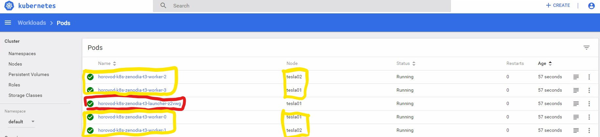
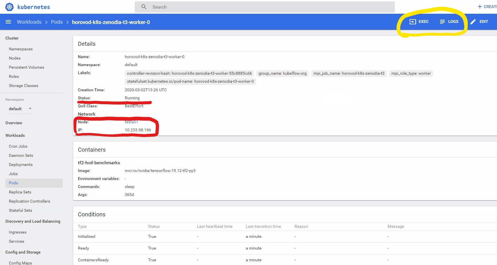
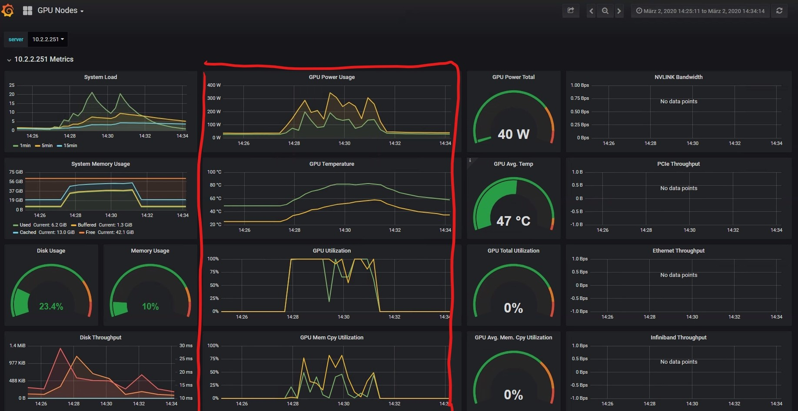
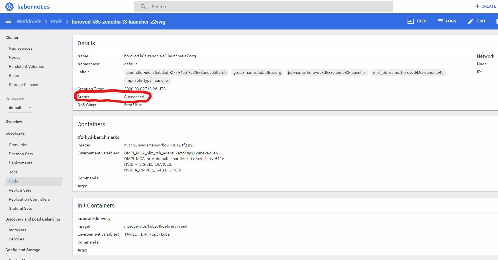
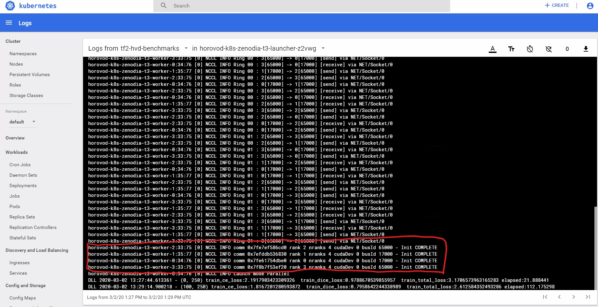

# Multi-node Training with Horovod and Kubernetes

In this guide, we present the possibility of executing our horovod implemtation on a multinode setup with Kubenetes as container ochestrator. 

## Requirements
Our script requires at least the following software and hardware configuration. 
 - 4 GPUs (does not matter whether their are on 1 or multiple nodes)
 - Kubernetes
 - [Kubeflow](https://www.kubeflow.org/) > 0.2.0
 - [MPI Operator for Kubeflow](https://github.com/kubeflow/mpi-operator)

To visualize the result we used the following additional tools: 
 - [Prometheus](https://prometheus.io/)
 - [Graphana](https://grafana.com/)
 - [Kubenetes Dashboard](https://kubernetes.io/docs/tasks/access-application-cluster/web-ui-dashboard/)

## How to run the test?

### Mount Directory
Our test assumes that you have cloned this repository to a *file server*, such as a NFS or EFS server. Our sample script uses a **nfs** srever. 
First you need to edit the `4gpu-k8s.yaml` file and edit the line 32-33 and 82-83.
```yaml
# Change this line to the current path to this repository.
                 server: your-server-ip-address
                 path: /current/path/to/TF2_Workshop
```
Please make sure that you put in the **absolute path** here as relative path is not working. 

### Apply the job
```bash
$ kubectl apply -f 4gpu-k8s.yaml
```
This script will start **4 worker containers** and **1 launcher container** in your kubernetes cluster. See below for expected outcome. 

Note that each worker container will have 1 GPU. If you do not have enough GPUs in your kubernetes cluster, then you have to change the number of **workers** accordingly. For that, edit `4gpu-k8s.yaml` on line 75.
```yaml
#change this to the desired number of replicas
      replicas: 4
```

## Expected Outcome

### Our setup
Our kubenetes cluster is deployed with [NVIDIA's DeepOps](https://github.com/NVIDIA/deepops). If installed and configured correctly, you should have access to the Kubenetes Dashboard and Graphana for monitoring. 

### Jobs Monitoring
Once the job is running, you should be albe to find the 5 containers created by Kubeflow as shown in the figure below. The yellow part indicates four workers (replicas) that are actually doing the calculation. The red one indicates the launcher thread that manifestes and manages the workers. 



If we click on one of the workers, we can find out the status of the container is running (see red lin). Futhermore, the network information is available, as well as the physical location (red box). In the upper right corner, you can access the container itself and its logs via the "exec" and "logs" button (yellow box).



We can also have a look at the current GPU utilization info by logging into Grafana. As shown in the following figure, GPU power utilization, temperature and other important information can be seen, indicating the currect execution of our multinode, multi-GPU job. 



Once the job execution is completed, you can access see that the status of the **launcher** job is changed to "Succeeded" (red box) in the following image. Furthermore, the worker pods are removed from Kubenetes automaticly. 



Finally, you can inspect the log file created by the launcher job by clicking on the LOGS button in the upper right corner.

As shown in the figure below, we can see that each worker has detected a single GPU correctly, and NCCL communicators is created accordingly (red box) for efficient communication. 


